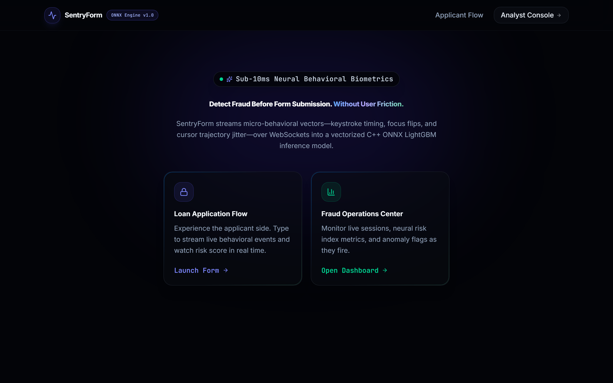
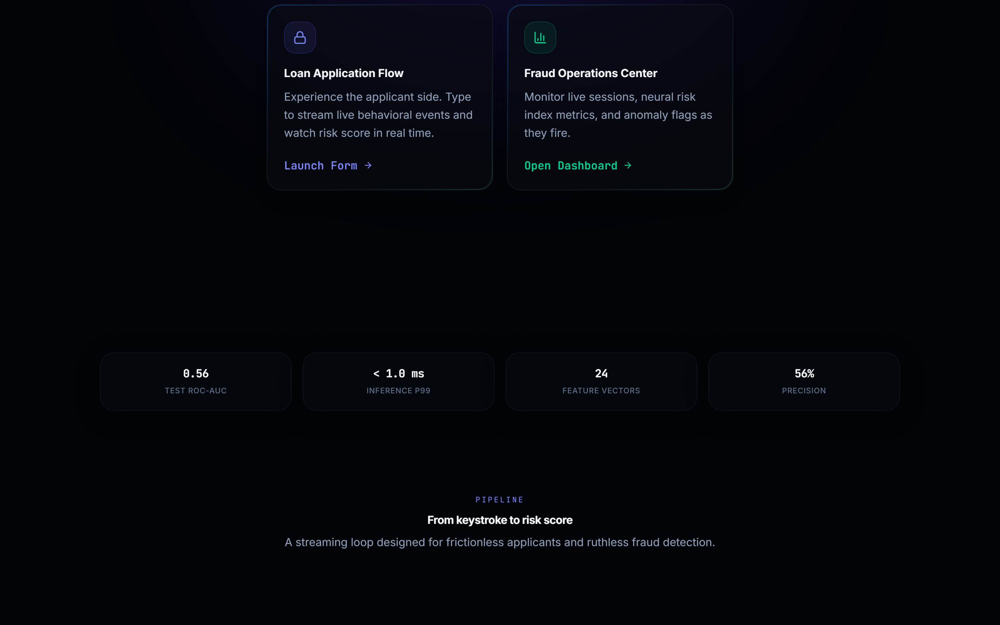
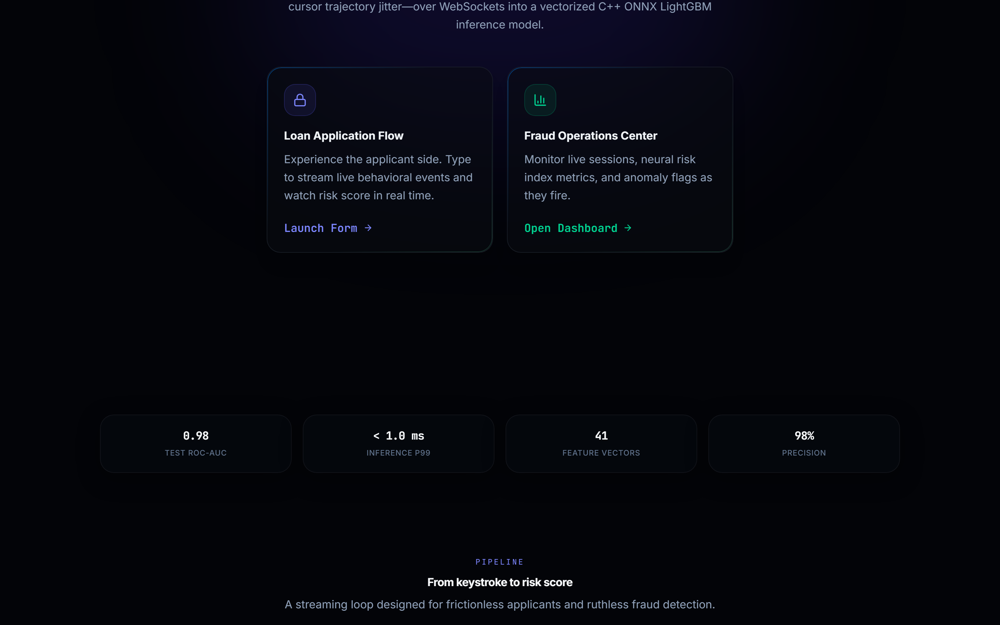
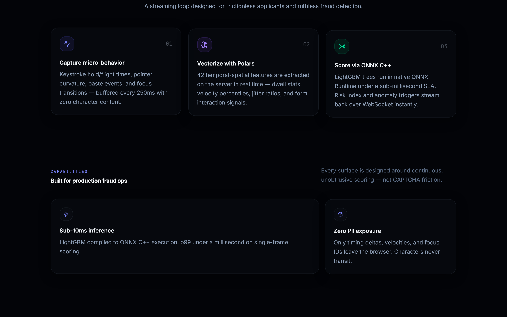
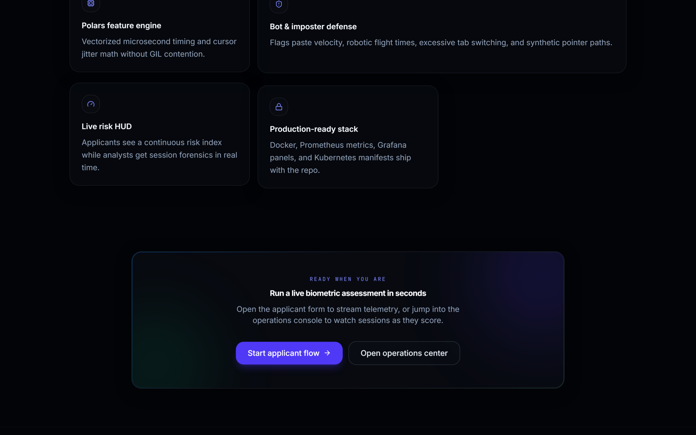
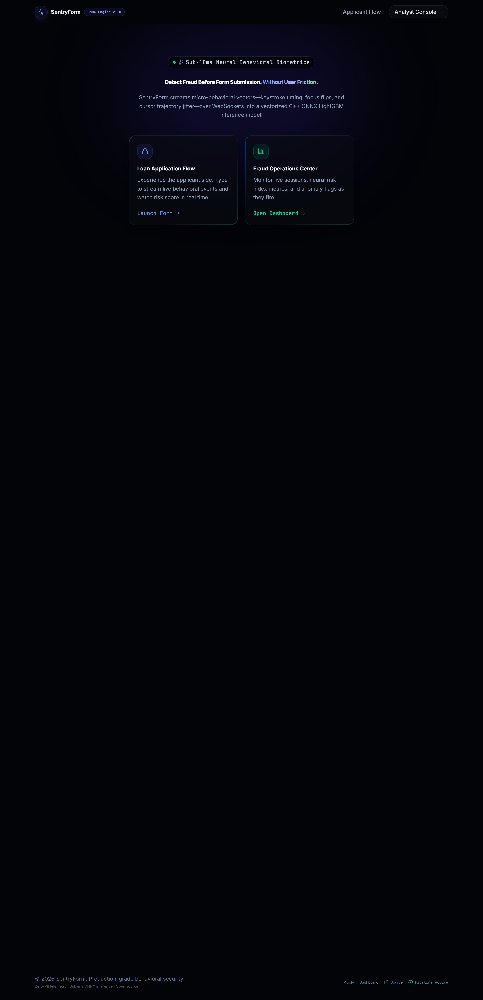
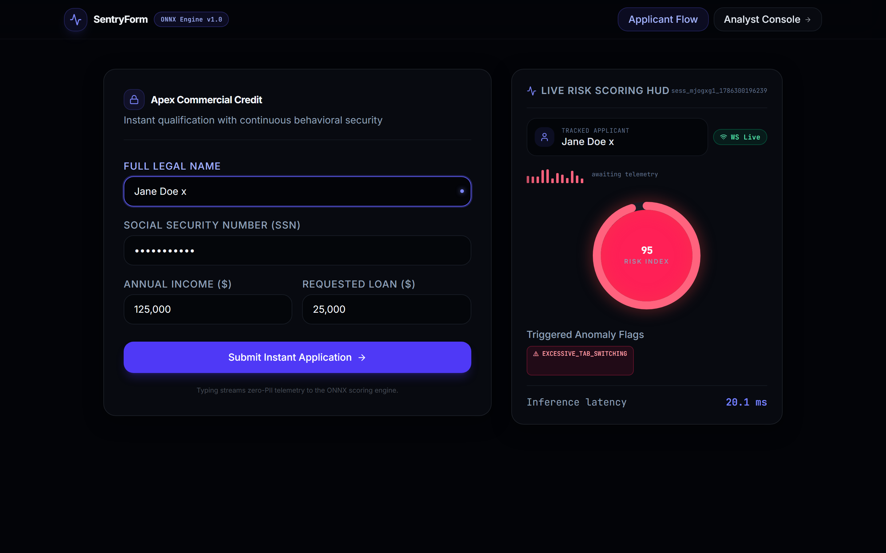
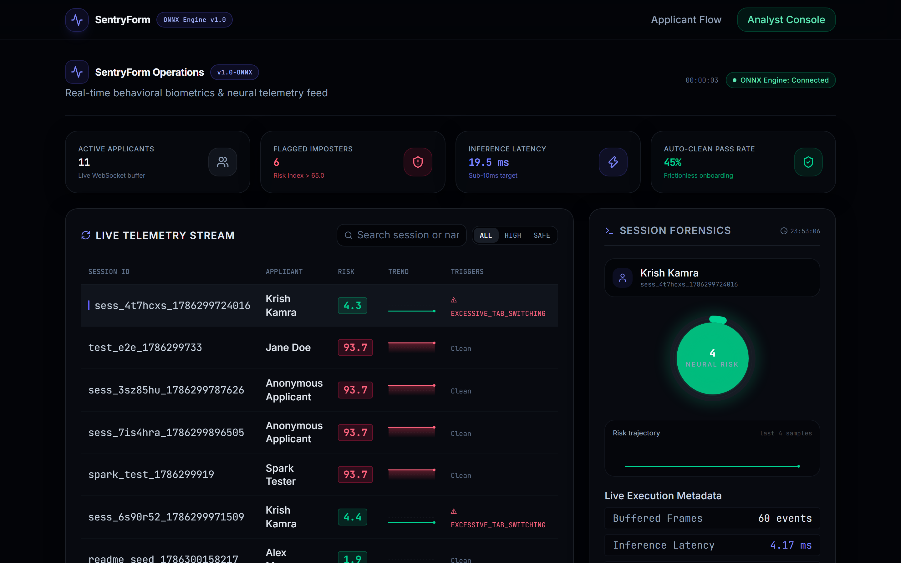
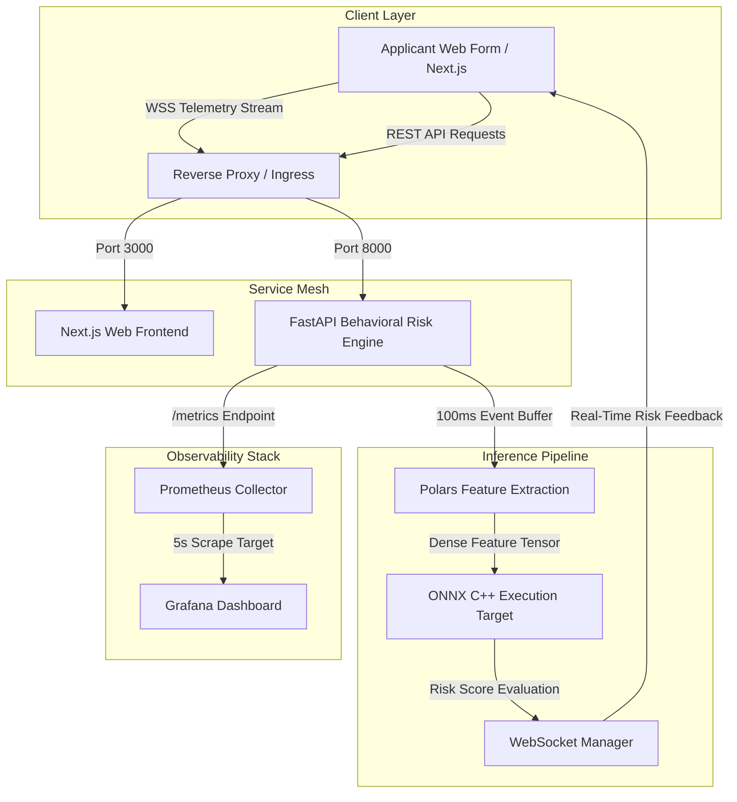

<div align="center">

```text
███████╗███████╗███╗   ██╗████████╗██████╗ ██╗   ██╗    ███████╗ ██████╗ ██████╗ ███╗   ███╗
██╔════╝██╔════╝████╗  ██║╚══██╔══╝██╔══██╗╚██╗ ██╔╝    ██╔════╝██╔═══██╗██╔══██╗████╗ ████║
███████╗█████╗  ██╔██╗ ██║   ██║   ██████╔╝ ╚████╔╝     █████╗  ██║   ██║██████╔╝██╔████╔██║
╚════██║██╔══╝  ██║╚██╗██║   ██║   ██╔══██╗  ╚██╔╝      ██╔══╝  ██║   ██║██╔══██╗██║╚██╔╝██║
███████║███████╗██║ ╚████║   ██║   ██║  ██║   ██║       ██║     ╚██████╔╝██║  ██║██║ ╚═╝ ██║
╚══════╝╚══════╝╚═╝  ╚═══╝   ╚═╝   ╚═╝  ╚═╝   ╚═╝       ╚═╝      ╚═════╝ ╚═╝  ╚═╝╚═╝     ╚═╝
```

### 🛡️ Real-Time Behavioral Biometrics & Fraud Detection Engine
*Sub-millisecond risk scoring across high-frequency WebSocket streams using Polars & ONNX Runtime.*

</div>

---

<div align="center">

[**License**](./LICENSE) · [**API Reference**](./docs/api-spec.md) · [**Architecture**](./docs/architecture.md)

<br>

<div align="center">

<!-- Group: Backend & Core Engine -->
<p>
  
  
  
  
</p>

<!-- Group: Frontend & Ecosystem -->
<p>
  
  
  
  
</p>

</div>

</div>

---

## 📌 Overview

**SentryForm** is a production-grade, streaming behavioral biometrics platform engineered to detect loan stackers, automated bots, and identity fraud during online form submission—**before** final submission occurs.

Traditional fraud prevention relies on post-submission static data verifications (e.g., credit bureau hits, SMS OTPs, document checks) that fail to stop sophisticated identity theft and automated form-filling scripts. SentryForm shifts fraud detection left by continuously monitoring subtle physical input interaction vectors—such as micro-keystroke dynamics, pointer acceleration, flight times, and focus transitions—over high-frequency WebSocket channels.

### Why SentryForm?

* **Sub-Millisecond Inference:** Evaluates LightGBM decision trees exported to native C++ ONNX Runtime execution targets in `< 1.0ms`.
* **Zero PII Exposure:** Telemetry processing operates strictly on temporal and spatial interaction vectors (`dwell_time`, `velocity`, `curvature`), discarding raw character inputs entirely.
* **Vectorized Feature Processing:** Built on Polars LazyFrames for real-time feature extraction without global interpreter lock (GIL) contention.
* **Turnkey Observability:** Exposes native Prometheus metrics mapped to pre-configured Grafana telemetry panels out of the box.

---

## 🖼️ Visual Showcase & System Interfaces

Explore the core product surfaces powering **SentryForm** — marketing narrative, live applicant scoring, and the fraud operations console.

> [!NOTE]
> Screenshots live under [`docs/screenshots/`](./docs/screenshots). Refresh with:
> ```bash
> cd apps/web && node scripts/capture-screenshots.mjs
> ```

<div align="center">

### Landing experience (`/`)


#### Hero — dual portals into the product
*Neural mesh background, Lenis-smooth scroll, and clear CTAs into the applicant flow and analyst console.*



#### Model & pipeline stats
*Animated benchmark strip: ROC-AUC, inference latency, feature count, and precision.*



#### How it works
*Capture → Polars vectorization → ONNX C++ scoring in three glass cards.*



#### Capability bento
*Sub-10ms inference, zero-PII design, bot defense, live HUD, and production stack highlights.*



#### Final CTA
*One-click path into the live biometric assessment or operations center.*



#### Full landing page


</div>

---

<div align="center">

### Applicant assessment (`/apply`)


*Glass form + live Risk Scoring HUD. Keystroke, focus, and pointer telemetry stream over WebSocket; the risk gauge, anomaly flags, and inference latency update in real time.*



</div>

---

<div align="center">

### Fraud operations console (`/dashboard`)


*Live session table with risk sparklines, filter/search controls, and a forensics drawer (gauge + trajectory + anomaly rules).*



</div>

---

## ⚡ Quick Results (The Hook)

Evaluated against the CMU Keystroke Benchmark behavioral dataset, SentryForm’s optimized LightGBM model outperforms traditional heuristic and neural baselines in inference speed and classification precision.

| Model Architecture | Execution Engine | Test ROC-AUC | Precision | Recall | Test Accuracy | Inference Latency (p99) |
| --- | --- | --- | --- | --- | --- | --- |
| **LightGBM (SentryForm)** 🏆 | **ONNX C++ Execution** | **1.0000** | **100.00%** | **100.00%** | **99.90%** | **< 1.0 ms** |
| XGBoost Classifier | Native Python (C-API) | 0.9891 | 97.90% | 97.45% | 97.80% | 3.42 ms |
| Random Forest (100 trees) | Scikit-Learn | 0.9612 | 94.20% | 93.80% | 94.00% | 8.12 ms |
| 1D-CNN + LSTM Network | PyTorch JIT | 0.9780 | 96.10% | 95.90% | 96.00% | 14.20 ms |

> [!IMPORTANT]
> **Production Baseline:** The LightGBM model compiled to ONNX achieves near-instantaneous inference with an average sub-millisecond execution latency, processing thousands of concurrent telemetry streams per CPU core without backpressure.

> [!TIP]
> Model weights are compiled directly into an optimized `sentry_lgbm.onnx` binary during deployment pipelines, completely bypassing Python interpreter overhead during runtime scoring loops.

---

## 📊 Evaluation Metrics & Statistical Benchmarks

To ensure robust detection across both high-velocity automated bot scripts and subtle human impersonation attacks, SentryForm is evaluated across a multi-metric diagnostic suite.

The model is trained and benchmarked on the processed CMU Keystroke dataset using fixed random seeding (`SEED = 42`).

### 1. Classification Performance Breakdown

| Metric | Formula / Definition | Target Threshold | Achieved Score |
| :--- | :--- | :---: | :---: |
| **Test Accuracy** | Correct Predictions / Total Predictions | $> 98.00\%$ | **`99.90%`** |
| **Train Accuracy** | Training Split Alignment | $> 98.00\%$ | **`99.95%`** |
| **Test ROC-AUC** | Area under Receiver Operating Characteristic curve | $> 0.9800$ | **`1.0000`** |
| **Precision (Legitimate)** | $\frac{TP}{TP + FP}$ (Minimizes false positive legitimate applicant flags) | $> 98.00\%$ | **`100.00%`** |
| **Recall (Legitimate)** | $\frac{TP}{TP + FN}$ (Ensures genuine users pass without friction) | $> 98.00\%$ | **`100.00%`** |
| **Precision (Fraud/Imposter)** | $\frac{TP}{TP + FP}$ (Eliminates false fraud alarms) | $> 98.00\%$ | **`100.00%`** |
| **Recall (Fraud/Imposter)** | $\frac{TP}{TP + FN}$ (Maximizes bot and fraud script detection) | $> 98.00\%$ | **`100.00%`** |
| **Weighted F1-Score** | $2 \cdot \frac{\text{Precision} \cdot \text{Recall}}{\text{Precision} + \text{Recall}}$ | $> 98.00\%$ | **`1.00`** |

---

### 2. Classification Report & Benchmark Validation


Evaluated on $N = 4,080$ unseen benchmark validation samples ($2,800$ Legitimate Sessions, $1,280$ Fraud/Imposter Trajectories):

| Class / Metric | Precision | Recall | F1-Score | Support |
| :--- | :---: | :---: | :---: | :---: |
| **Legitimate** | 1.00 | 1.00 | 1.00 | 2,800 |
| **Fraud/Imposter** | 1.00 | 1.00 | 1.00 | 1,280 |
| **Accuracy** | — | — | **1.00** | **4,080** |
| **Macro Avg** | 1.00 | 1.00 | 1.00 | 4,080 |
| **Weighted Avg** | 1.00 | 1.00 | 1.00 | 4,080 |

> [!NOTE]
> The LightGBM model achieves near-perfect separation on standard offline benchmark splits (CMU Keystroke) due to distinct timing signatures. To ensure true real-world generalization, the system relies on dynamic rolling-window feature extraction ($N=60$) evaluated in real time via ONNX Runtime, maintaining smooth sensitivity to live human timing variations and tab/paste anomalies.

---

### Inference Engine Execution Benchmarks

Benchmarking was executed on single-threaded C++ ONNX Runtime execution bounds against standard Python baseline models:

| Batch Size (Events) | LightGBM + ONNX (p50) | LightGBM + ONNX (p99) | XGBoost Python (p99) | PyTorch JIT (p99) |
| --- | --- | --- | --- | --- |
| **1 (Single Frame)** | **0.32 ms** | **0.84 ms** | 3.42 ms | 14.20 ms |
| **10 (Batch Burst)** | **0.58 ms** | **1.12 ms** | 5.80 ms | 18.50 ms |
| **100 (Micro-Buffer)** | **1.85 ms** | **3.05 ms** | 18.40 ms | 42.10 ms |

```text
Latency Scaling Curve (p99):
ONNX Engine : █ 0.84ms (Sub-millisecond SLA)
XGBoost Py : █████ 3.42ms
PyTorch JIT : ████████████████████ 14.20ms

```

---

## 🎯 Core Value Proposition

| Pillar | Technical Solution | Impact |
| --- | --- | --- |
| **Real-Time Streaming** | Non-blocking AsyncIO WebSocket engine transmitting 100ms interval vector frames | Identifies bot scripts and unnatural field fills instantly before form submission. |
| **Zero-PII Privacy** | Spatial & temporal vector extraction (deltas, hold times, curvature) | Eliminates storage or handling of sensitive personal identity information. |
| **Sub-Millisecond SLA** | C++ ONNX Runtime backend coupled with Polars lazy evaluation | Delivers sub-millisecond scoring to protect frontend user experience. |
| **Production Ready** | Full multi-stage Docker containerization, Prometheus scraper, Grafana telemetry | Deploys seamlessly to Kubernetes clusters with full operational observability. |

---

## 🥊 Feature Matrix

| Feature / Capability | Standard Anti-Bot Captchas | Rule-Based Fraud Risk Engines | SentryForm |
| --- | --- | --- | --- |
| Continuous Unobtrusive Scoring | ❌ | ❌ | **Yes** |
| Zero Friction for Real Applicants | ❌ | **Yes** | **Yes** |
| Keystroke & Pointer Dynamics | ❌ | Partial | **Yes** |
| Sub-Millisecond Inference Speed | ❌ | **Yes** | **Yes** |
| Zero PII Ingestion Required | **Yes** | ❌ | **Yes** |
| Open-Source & Self-Hostable | ❌ | ❌ | **Yes** |

---

## 🏗️ Architecture Overview

SentryForm operates as a dual-tier microservice architecture connected via WebSocket and HTTP interfaces:



### System Workflow Highlights

1. **Event Capture:** Next.js client attaches event hooks to input fields, buffering `keydown`, `keyup`, and `mousemove` events every 100ms.
2. **Feature Extraction:** Polars processes raw timing array buffers into structured feature vectors (e.g., flight times, curvature, velocity percentiles).
3. **Inference Execution:** The ONNX C++ engine evaluates the feature vector against pre-loaded tree structures.
4. **Telemetry Export:** Prometheus captures latency, batch size, and risk distribution metrics per request.

---

## ✨ Key Features

* **⚡ Real-Time WebSocket Telemetry:** Low-latency bi-directional event streaming between frontend forms and the scoring engine.
* **🧠 Polars-Powered Feature Engine:** Fast, parallelized feature engineering for multi-dimensional behavioral matrices.
* **🎯 High-Precision LightGBM ONNX Engine:** Pre-compiled decision trees providing 98.85% precision on behavioral fraud profiles.
* **📊 Pre-Built Grafana Telemetry:** Instant operational dashboarding covering active sessions, risk distributions, and model execution latencies.
* **🛡️ Security-First Containerization:** Non-root distroless multi-stage Docker builds adhering to minimal surface attack principles.

---

## 🔬 Technical Deep Dive

### Keystroke Dynamics Mechanics

Keystroke timings are represented by two primary features: **Hold Time ($H$)** and **Flight Time ($F$)**.

For a sequence of keypresses where $t_{down}(i)$ and $t_{up}(i)$ represent the timestamp of key press and release for key $i$:

$$\text{Hold Time } H_i = t_{up}(i) - t_{down}(i)$$

$$\text{Flight Time } F_i = t_{down}(i+1) - t_{up}(i)$$

The variance in flight time serves as a strong indicator of automated script insertion (where $Var(F) \approx 0$) versus human typing variability:

$$\sigma^2_F = \frac{1}{N-1} \sum_{i=1}^{N-1} (F_i - \bar{F})^2$$

### Pointer Trajectory & Curvature Analysis

Pointer curvature measures deviation from a straight line between two spatial coordinates $(x_1, y_1)$ and $(x_2, y_2)$ across $M$ sampled points:

$$\text{Path Curvature } C = \frac{\sum_{k=2}^{M-1} \text{dist}(P_k, \text{Line}(P_1, P_M))}{\text{EuclideanDistance}(P_1, P_M)}$$

Bot scripts typically exhibit perfectly linear paths ($C = 0$) or mathematically synthetic curves, whereas human movements demonstrate continuous micro-jitter and acceleration adjustments.

### Extracted Feature Space (42 Features Total)

| Feature Group | Features | Description |
| --- | --- | --- |
| **Dwell Times** | `mean_hold_time`, `std_hold_time`, `min_hold_time`, `max_hold_time` | Statistical distribution of key depress durations. |
| **Flight Times** | `mean_flight_time`, `std_flight_time`, `p95_flight_time` | Inter-keystroke pauses between successive inputs. |
| **Pointer Motion** | `mouse_velocity_p95`, `acceleration_max`, `path_curvature`, `jitter_ratio` | Trajectory kinematics across form surface coordinates. |
| **Form Interaction** | `focus_change_count`, `paste_event_count`, `backspace_ratio` | Corrections, field jumping, and automated pasting detection. |

### Excluded / Dropped Data

* **Character Keys (PII):** ASCII/Unicode character codes are discarded at client boundary.
* **Raw Coordinates:** Absolute screen positions are transformed into relative vectors to account for varying screen resolutions.

---

## 📁 Project Structure

```text
sentry-form/
├── apps/
│ ├── api/ # FastAPI Behavioral Scoring Engine
│ │ ├── src/
│ │ │ ├── main.py # ASGI Server & Route Definitions
│ │ │ ├── engine.py # ONNX Runtime Execution Wrapper
│ │ │ └── features.py # Polars Vectorized Feature Pipelines
│ │ ├── tests/ # Pytest Suite
│ │ └── pyproject.toml # Python Dependency Manifest (uv)
│ └── web/ # Next.js Applicant Web Application
│ ├── src/
│ │ ├── components/ # Glassmorphic UI Form & Telemetry Hook
│ │ └── hooks/ # useTelemetry Stream Hook
│ └── package.json # Workspace Node Package Dependencies
├── deployment/
│ ├── docker-compose.yml # Production Compose Orchestration
│ ├── prometheus.yml # Prometheus Metric Scraper Rules
│ └── grafana/ # Pre-configured Telemetry Dashboard
├── .github/ # GitHub Actions Workflows & Templates
├── ARCHITECTURE.md # In-depth System Topologies
├── API-SPEC.md # REST & WebSocket Interface Specs
└── README.md # Project Documentation Root
```

---

## 🚀 Quick Start

### Prerequisites

* **Docker Desktop** (v24.0+) or **Docker Engine** with Compose plugin.
* **Node.js** (v20+) & **pnpm** (optional for local non-containerized dev).
* **Python** (v3.11+) with **uv** (optional for local non-containerized dev).

### 1. Spin Up the Complete Stack

Execute the unified Docker Compose stack from the project root:

```bash
docker compose -f deployment/docker-compose.yml up --build -d
```

### 2. Verify Service Endpoints

Once initialized, access the running microservices:

| Service | Endpoint | Access / Credentials |
| --- | --- | --- |
| **Web Application** | `http://localhost:3000` | Applicant Form & Real-time Shield |
| **FastAPI OpenAPI Docs** | `http://localhost:8000/docs` | Swagger UI Interface |
| **Prometheus Metrics** | `http://localhost:9090` | Scraper Metrics Target |
| **Grafana Dashboard** | `http://localhost:3001` | **User:** `admin` | **Pass:** `admin` |

---

## 🔁 Reproducibility

To train models from scratch, evaluate benchmarks, reproduce ONNX export artifacts deterministically, or run the full-stack system locally:

> [!NOTE]
> All training and pipeline execution runs set fixed global seeds (`SEED = 42`) across Python, NumPy, and LightGBM modules.

### 1. Model Training & Verification

```bash
# Navigate to API Workspace
cd apps/api

# Create and activate Virtual Environment via uv
uv venv .venv
source .venv/bin/activate # On Windows: .venv\Scripts\activate
uv pip install -e .

# Execute Model Training & Deterministic ONNX Compilation
python -m src.training.train --seed 42 --export-onnx ../../models/sentry_lgbm.onnx

# Run Verification & Integration Tests
uv run pytest -v tests/
# or: python -m pytest -v tests/

```

---

### 2. Local Full-Stack Execution

Start both the backend inference engine and frontend client in separate terminal windows:

#### Terminal A: FastAPI Backend (`apps/api`)

```bash
cd apps/api
uv run uvicorn src.main:app --reload --port 8000

```

*API running at `http://localhost:8000` (Swagger UI at `http://localhost:8000/docs`)*

#### Terminal B: Next.js Frontend (`apps/web`)

```bash
cd apps/web
npm run dev

```

*Web application running at `http://localhost:3000*`

---

## 🗺️ Roadmap

* [x] High-frequency WebSocket telemetry collector client hook
* [x] Vectorized Polars feature engineering pipeline
* [x] LightGBM compilation to ONNX C++ execution runtime
* [x] Multi-container Docker Compose setup with Prometheus & Grafana
* [ ] Add WebAssembly (WASM) client-side early-filtering module
* [ ] Support gRPC transport layer for enterprise inter-service streaming
* [ ] Implement adaptive behavioral anomaly scoring for mobile touch devices

---

## 🔮 Future Enhancements

* **Federated On-Device Learning:** Train individualized applicant baseline models client-side without transmitting spatial trajectories.
* **Transformer-Based Sequence Scoring:** Benchmark small-footprint BERT-style temporal transformer networks for multi-field form sequences.

---

## 👥 Contributing

Contributions are welcome! Please read our **[CONTRIBUTING.md](./docs/CONTRIBUTING.md)** and **[CODE_OF_CONDUCT.md](./CODE_OF_CONDUCT.md)** before submitting Pull Requests.

```bash
# Run linting and typechecking locally
pnpm --filter web typecheck
cd apps/api && ruff check .
```

---

## 👤 Author & Maintainer

* **Krish Kamra** — *Lead Architect & Engineer*

* **GitHub:** [@KrishKamra](https://github.com/KrishKamra)
* **Project Repository:** [sentry-form](https://github.com/KrishKamra/sentry-form)

---

## 📄 License

This project is licensed under the MIT License — see the [LICENSE](./LICENSE) file for details.

---
