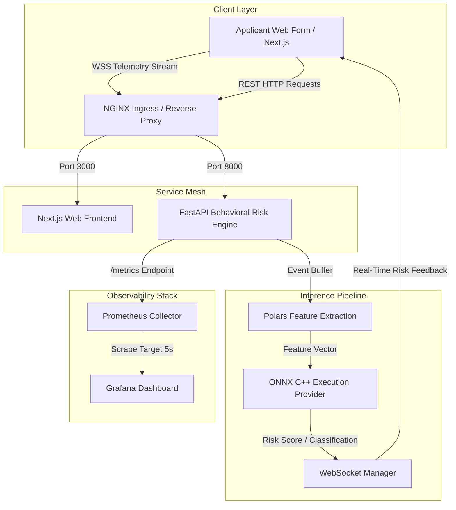
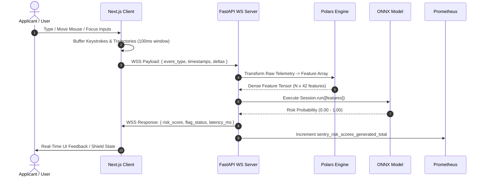

# 🏗️ SentryForm — System Architecture & Data Pipelines

SentryForm is a high-throughput, sub-millisecond behavioral biometrics assessment engine. It continuously tracks applicant interaction telemetry (keystroke dynamics, pointer trajectories, focus events) over secure WebSocket streams, extracts features in real time using Polars, and evaluates risk scores via native ONNX LightGBM inference.

---

## 📐 System Topology Overview

> [!NOTE]
> SentryForm operates as a dual-tier microservice stack. The **Next.js Web Frontend** captures and streams client-side behavioral events over WebSockets, while the **FastAPI Engine** performs feature transformation, scoring, and telemetry metric exports.



---

## 🔄 Real-Time Telemetry Sequence

> [!IMPORTANT]
> To prevent network jitter and backpressure, applicant input events are batched on the client every **100ms** before transmission across the WebSocket tunnel.



---

## 🛠️ Core Subsystems

### 1. Telemetry Collector & Frontend (`apps/web`)

* **Framework:** Next.js 14+ (App Router, React 19)
* **Styling & Motion:** Tailwind CSS, Framer Motion 3D glassmorphic UI
* **Event Listeners:** High-frequency event listeners bound to form inputs to capture:
* Keypress Hold Time (`keydown` to `keyup` delta in ms)
* Flight Time (inter-key pause duration)
* Pointer Acceleration & Curvature Vector


> [!TIP]
> All client telemetry is anonymized before leaving the browser. Raw character values are discarded; only timing intervals, pixel vectors, and focus transition IDs are transmitted.

### 2. Behavioral Risk Engine (`apps/api`)

* **Framework:** FastAPI / Uvicorn (ASGI)
* **Data Processing:** Polars LazyFrames for vectorized temporal aggregations.
* **Inference Runtime:** `onnxruntime` executing pre-compiled LightGBM decision trees (`sentry_lgbm.onnx`).
* **Instrumentation:** `prometheus_client` tracking histogram latency buckets and connection gauge counters.

---

## 📊 Feature Extraction Pipeline

| Feature Category | Metrics Calculated | Technical Description |
| --- | --- | --- |
| **Keystroke Dynamics** | `mean_hold_time`, `std_flight_time` | Calculates typing rhythm variance and dwell times across alphanumeric sequences. |
| **Pointer Trajectory** | `mouse_velocity_p95`, `path_curvature` | Computes 2D spatial acceleration, jitter, and straight-line deviation angle. |
| **Form Interaction** | `backspace_ratio`, `paste_event_count` | Monitors anomaly triggers such as robotic automated pastes or abnormal correction loops. |

---

## 🚢 Deployment & Orchestration Strategy

> [!CAUTION]
> In Kubernetes production environments, sticky sessions (`proxy-read-timeout 3600`) MUST be enabled on the Ingress Controller to prevent WebSocket disconnection during pod autoscaling.

```text
deployment/
├── docker-compose.yml           # Unified local multi-container stack
├── prometheus.yml               # Scrape target config (5s interval)
├── grafana/
│   └── dashboard/
│       └── risk_metrics.json    # Operational telemetry dashboard
└── kubernetes/
    ├── deployment.yaml          # Deployments for API & Web with rolling updates
    ├── service.yaml             # ClusterIP services with Prometheus annotations
    └── ingress.yaml             # NGINX Ingress with WebSocket upgrade headers

```